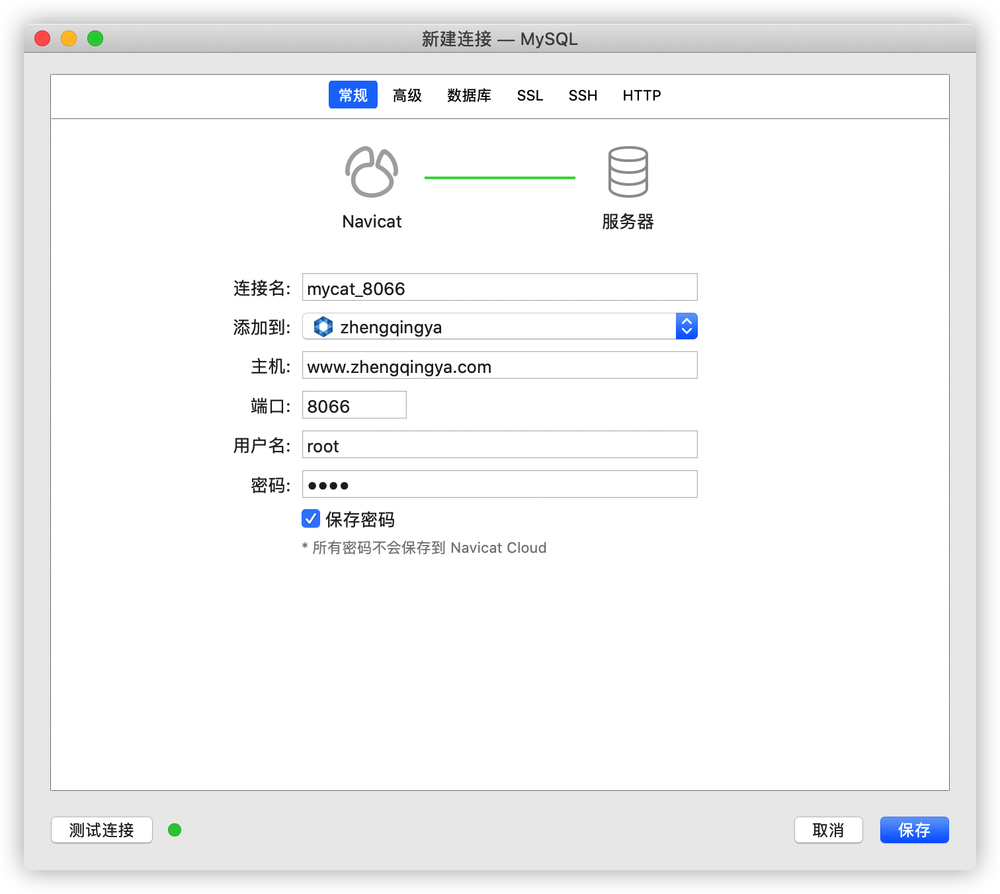

### Mycat

> Java语言编写的MySQL数据库网络协议的开源中间件

```shell
docker-compose -f docker-compose-mycat.yml -p mycat up -d
```

Navicat可视化工具连接参数

> mysql -hwww.xxx.com -P8066 -uroot -proot

| 名称           | 值                  |
| -------------- | ------------------- |
| 连接名         | mycat_8066          |
| 主机名或IP地址 | www.xxx.com |
| 端口           | 8066                |
| 用户名         | root                |
| 密码           | root                |



### Mycat-web

> Mycat可视化运维的管理和监控平台

```shell
docker-compose -f docker-compose-mycat-web.yml -p mycat-web up -d
```

访问地址：[`ip地址:8082/mycat`](http://www.xxx.com:8082/mycat)
